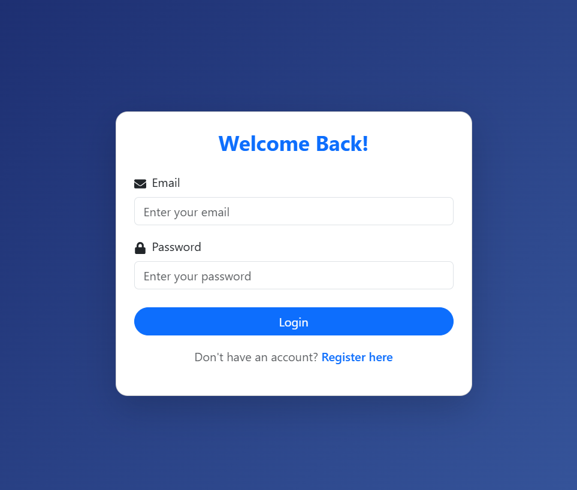
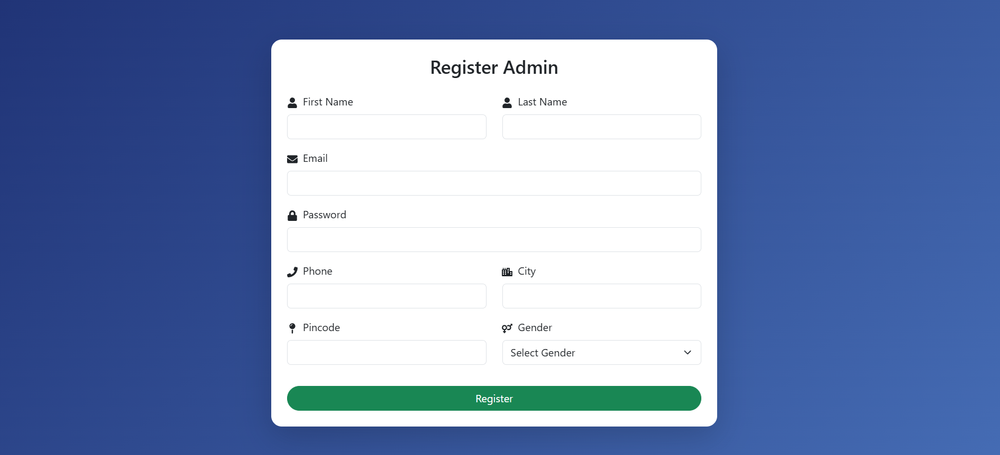
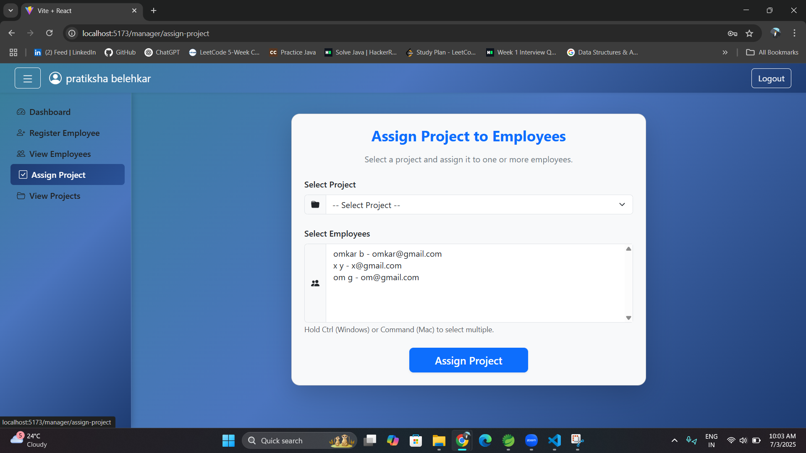
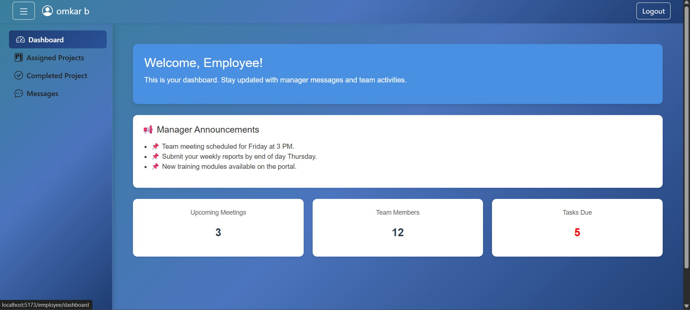

# 📋 Project Management System

A full-stack web application built using **Spring Boot**, **MySQL**, and **React (Vite)** to efficiently manage projects in a corporate environment. This system supports **Admin**, **Manager**, and **Employee** roles — each with dedicated dashboards and REST APIs.

---

## 🚀 Tech Stack

| Layer      | Technology Used                         |
|------------|------------------------------------------|
| Frontend   | React.js, Vite, React Bootstrap          |
| Backend    | Spring Boot (Java), REST APIs            |
| Database   | MySQL                                    |
| Auth       | JWT (JSON Web Tokens)                    |

---

## 🎯 Roles & Functionalities

### 🔐 Public User
- 🔹 **Register as Admin** → `POST /api/auth/register`
- 🔹 **Login** (Admin/Manager/Employee) → `POST /api/auth/login`
> Once logged in, users receive a **JWT Token** to access secured routes.

---

### 🧑‍💼 Admin Dashboard
- 🔹 Register/View/Update/Delete Managers  
  - `POST /api/admin/managers`  
  - `GET /api/admin/managers`  
  - `PUT/DELETE /api/admin/managers/{id}`  
- 🔹 Create/View/Update/Delete Projects  
  - `POST /api/admin/projects`  
  - `GET /api/admin/projects`  
  - `PUT/DELETE /api/admin/projects/{id}`  
- 🔹 Assign Project to Manager → `PUT /api/admin/projects/assign`
- 🔹 View Task Status → `GET /api/admin/employee-project-status`

---

### 👨‍💼 Manager Dashboard
- 🔹 View Assigned Projects → `GET /api/manager/projects`
- 🔹 Register/View Employees  
  - `POST /api/manager/employees`  
  - `GET /api/manager/employees`  
- 🔹 Assign Project to Employees → `POST /api/manager/assign-project`
- 🔹 View Task Status → `GET /api/manager/assignments`
- 🔹 Update Project Status → `PUT /api/manager/assignment-status/{employeeProjectId}`

---

### 👩‍💻 Employee Dashboard
- 🔹 View Assigned Projects → `GET /api/employee/projects`
- 🔹 Update Project Status → `PUT /api/employee/project-status/{projectId}`  
> (Task Status: `NOT_STARTED`, `IN_PROGRESS`, `COMPLETED`)

---

## 📸 Screenshots

| Login | Admin Dashboard | Manager Dashboard |
|-------|------------------|-------------------|
|  |  |  |

| Register Admin | Assign Projects | Employee Dashboard |
|----------------|------------------|---------------------|
|  |  |  |

> 🧠 You can explore more in the `assets/` folder.

---

## 🎥 Demo Video

[📹 Click to View Demo]
https://github.com/user-attachments/assets/fcd8034b-2add-4d42-98ab-1830cbd39398

---

## 📂 Project Structure

```bash
ProjectManagementSystem/
├── backend/       # Spring Boot API
├── frontend/      # React Vite frontend
├── assets/        # Screenshots and demo video
└── README.md
